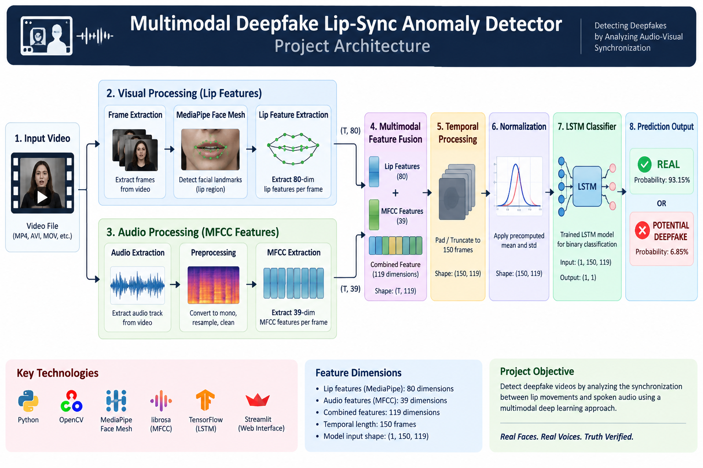

# 🎭 Multimodal Deepfake Lip-Sync Anomaly Detector

A multimodal deepfake detection system that analyzes the synchronization between **facial lip movements** and **spoken audio** to identify potential deepfake videos.

The project combines **Computer Vision**, **Audio Processing**, **Multimodal Feature Fusion**, and a **Temporal LSTM Neural Network** to classify videos as:

- ✅ **REAL**
- 🚨 **FAKE**

---

# 📌 Project Overview

Deepfake videos have become increasingly realistic, making traditional visual-artifact-based detection challenging.

Instead of relying only on visual artifacts, this project focuses on a multimodal approach:

> **Do the speaker's lip movements correspond to the spoken audio?**

The system analyzes multiple aspects of a video:

- 👄 Visual lip movement
- 🔊 Audio characteristics
- 🎵 MFCC audio features
- 🔗 Audio-visual feature relationships
- ⏱ Temporal patterns across video frames

These features are combined into a multimodal representation and processed using an **LSTM-based temporal classification model**.

The final system predicts whether a video is likely:

- **REAL**
- **FAKE**

---

# 🧠 Key Features

- 🎥 Video-based deepfake detection
- 👄 Lip landmark extraction using MediaPipe Face Mesh
- 🔊 Audio feature extraction
- 🎵 MFCC-based audio analysis
- 🔗 Multimodal audio-visual feature fusion
- ⏱ Temporal sequence modeling
- 🧠 LSTM-based classification
- 📊 Model evaluation pipeline
- 📈 Threshold analysis
- 🧪 Multiple training experiments
- 🌐 Streamlit-based application interface
- 🔌 Backend detection components
- 🧹 Dataset management utilities
- 🧪 Unit testing structure
- 📚 Project documentation

---

# 🏗️ Project Architecture



The overall detection pipeline is:

```text
                    INPUT VIDEO
                         │
                         ▼
              ┌─────────────────────┐
              │   Video Processing  │
              └─────────────────────┘
                         │
                         ▼
                MediaPipe Face Mesh
                         │
                         ▼
                Lip Feature Extraction
                         │
                         ├───────────────┐
                         │               │
                         ▼               ▼
                  Video Features     Audio Extraction
                                         │
                                         ▼
                                      Librosa
                                         │
                                         ▼
                                   MFCC Features
                                         │
                         ┌───────────────┘
                         │
                         ▼
              Multimodal Feature Fusion
                         │
                         ▼
                119 Feature Representation
                         │
                         ▼
                 Temporal Padding / Trimming
                         │
                         ▼
                 Input Shape: (150, 119)
                         │
                         ▼
                    LSTM Classifier
                         │
                         ▼
                   REAL / FAKE
```

---

# 🔬 Detection Pipeline

The project follows a multimodal deepfake detection pipeline.

## 1️⃣ Video Input

A video is provided as input to the system.

Before processing, the video is validated to ensure that:

- The file exists
- The file is not empty
- The video can be opened successfully
- Video metadata can be read

---

## 2️⃣ Facial Landmark Detection

The video frames are processed using:

### MediaPipe Face Mesh

MediaPipe detects facial landmarks from each frame.

The system focuses primarily on landmarks around the:

- Upper lip
- Lower lip
- Mouth corners
- Surrounding mouth region

These landmarks provide information about lip movement over time.

---

## 3️⃣ Lip Feature Extraction

Lip landmarks are converted into numerical features.

The extracted features represent information related to:

- Lip position
- Lip movement
- Mouth geometry
- Relative landmark movement
- Temporal changes in facial motion

These visual features are extracted frame by frame.

---

## 4️⃣ Audio Extraction

The audio stream is extracted from the input video.

The extracted audio is then processed separately.

The audio pipeline prepares the signal for feature extraction.

---

## 5️⃣ MFCC Feature Extraction

Audio features are extracted using **MFCCs (Mel-Frequency Cepstral Coefficients)**.

MFCC features provide a compact representation of audio characteristics.

They are useful for analyzing properties related to speech.

The project uses audio processing techniques based on the Librosa library.

---

## 6️⃣ Multimodal Feature Fusion

The visual and audio features are combined.

```text
Lip Features
      +
Audio Features
      │
      ▼
Multimodal Feature Fusion
      │
      ▼
Combined Feature Representation
```

The resulting representation captures information from both:

- Visual modality
- Audio modality

The project uses a **119-dimensional multimodal feature representation**.

---

## 7️⃣ Temporal Sequence Construction

Deepfake detection cannot rely only on individual frames.

Lip movements and speech occur over time.

Therefore, the multimodal features are organized into temporal sequences.

The sequence processing includes:

- Padding short sequences
- Trimming long sequences
- Maintaining a fixed temporal length

The final input shape used by the model is:

```text
(150, 119)
```

Where:

- `150` represents the temporal sequence length
- `119` represents the multimodal feature dimension

---

## 8️⃣ LSTM Classification

The temporal feature sequences are processed using an **LSTM (Long Short-Term Memory) neural network**.

LSTMs are suitable for sequential data because they can learn relationships across time.

The model analyzes temporal patterns between:

- Lip movements
- Audio features
- Audio-visual relationships

The classifier produces a prediction indicating whether the video is:

```text
REAL
```

or

```text
FAKE
```

---

# 🧠 Machine Learning Model

The project uses a temporal LSTM-based model.

The model receives multimodal sequences with the shape:

```text
Sequence Length: 150
Feature Dimension: 119
```

The general learning pipeline is:

```text
Multimodal Features
        │
        ▼
Temporal Sequence
        │
        ▼
LSTM Network
        │
        ▼
Probability Score
        │
        ▼
Threshold Decision
        │
        ├── REAL
        │
        └── FAKE
```

---

# 📊 Model Prediction

The trained model generates a probability score.

A decision threshold is then used to determine the final classification.

Conceptually:

```text
Prediction Probability
        │
        ▼
Compare with Threshold
        │
        ├── Below Threshold → REAL
        │
        └── Above Threshold → FAKE
```

Threshold analysis scripts are included in the project to evaluate classification performance.

---

# 📁 Project Structure

```text
Deepfake-LipSync-Detector/
│
├── assets/
│   └── project_architecture.png
│
├── audio_processing/
│   ├── mfcc_extractor.py
│   └── mfcc_extractor_exp5.py
│
├── backend/
│   ├── __init__.py
│   ├── api.py
│   └── detector.py
│
├── configs/
│   └── config.py
│
├── docs/
│   ├── MODEL.md
│   ├── PIPELINE.md
│   └── PROJECT_OVERVIEW.md
│
├── evaluation/
│   ├── evaluate_model.py
│   ├── generalization_test.py
│   └── validation_threshold.py
│
├── feature_extraction/
│   └── unseen_lip_landmark_extractor.py
│
├── feature_fusion/
│   ├── feature_sync_baseline.py
│   ├── feature_sync_exp3.py
│   ├── feature_sync_exp5.py
│   └── sequence_builder_exp5.py
│
├── inference/
│   └── predict_video.py
│
├── models/
│   ├── lstm_model.py
│   └── threshold.json
│
├── notebooks/
│   ├── 01_feature_exploration.ipynb
│   └── 02_model_analysis.ipynb
│
├── pipeline/
│   ├── 01_build_manifest.py
│   ├── 02_extract_lip_features.py
│   ├── 03_extract_mfcc.py
│   ├── 04_build_multimodal_features.py
│   ├── 05_dataset_loader.py
│   ├── 05_validate_final_dataset.py
│   ├── 06_build_lstm_model.py
│   ├── 07_train_model.py
│   ├── 08_evaluate_model.py
│   ├── 10_generate_evaluation_plots.py
│   ├── 11_generate_results_summary.py
│   └── predict_video.py
│
├── scripts/
│   ├── check_project.py
│   ├── run_app.sh
│   └── test_inference.py
│
├── tests/
│   ├── __init__.py
│   ├── test_config.py
│   └── test_feature_utils.py
│
├── training/
│   ├── Dataset preparation scripts
│   ├── Dataset splitting scripts
│   ├── Training experiments
│   ├── Evaluation scripts
│   ├── Threshold analysis scripts
│   ├── Feature analysis scripts
│   └── Generalization experiments
│
├── utils/
│   └── multidataset_manager.py
│
├── .gitignore
├── app.py
├── README.md
└── requirements.txt
```

---

# ⚙️ Installation

## 1. Clone the Repository

```bash
git clone https://github.com/aradh-12/Deepfake-LipSync-Detector.git
```

Move into the project directory:

```bash
cd Deepfake-LipSync-Detector
```

---

## 2. Create a Virtual Environment

### macOS / Linux

```bash
python3 -m venv .venv
```

Activate the environment:

```bash
source .venv/bin/activate
```

### Windows

```bash
python -m venv .venv
```

Activate the environment:

```bash
.venv\Scripts\activate
```

---

## 3. Install Dependencies

```bash
pip install -r requirements.txt
```

---

# 🚀 Running the Application

The project includes an application entry point.

Run:

```bash
python app.py
```

Depending on the application configuration, the project can also be run through the included scripts.

---

# 🔮 Video Inference

The project contains inference functionality for predicting whether an input video is REAL or FAKE.

Relevant components include:

```text
inference/predict_video.py
pipeline/predict_video.py
backend/detector.py
```

The inference pipeline performs the following operations:

1. Load the input video
2. Extract visual lip features
3. Extract audio features
4. Generate multimodal features
5. Build the temporal sequence
6. Load the trained model
7. Generate prediction probability
8. Apply the classification threshold
9. Return the final result

---

# 🧪 Training Pipeline

The project contains multiple training experiments.

The training directory includes scripts for:

- Dataset preparation
- Dataset splitting
- Source-aware splitting
- Temporal dataset creation
- LSTM training
- Model evaluation
- Probability analysis
- Threshold optimization
- Error analysis
- Feature separation analysis
- Generalization testing

Examples include:

```text
training/train_lstm_exp5.py
training/train_lstm_exp6.py
training/train_lstm_exp7.py
training/train_lstm_exp8.py
training/train_lstm_exp9.py
training/train_lstm_exp10.py
training/train_lstm_exp11.py
training/train_lstm_exp12.py
training/train_lstm_exp13.py
training/train_lstm_exp14.py
training/train_lstm_exp15.py
```

These experiments were used to investigate different feature representations, thresholds, dataset strategies, and temporal modeling approaches.

---

# 📊 Evaluation

The project contains evaluation components for analyzing model performance.

The evaluation pipeline includes:

```text
evaluation/evaluate_model.py
evaluation/generalization_test.py
evaluation/validation_threshold.py
```

The training directory also includes additional evaluation scripts.

Evaluation focuses on understanding:

- Model prediction behavior
- Probability distributions
- Classification thresholds
- Dataset performance
- Feature separation
- Temporal feature behavior
- Generalization performance

---

# 🎯 Threshold Analysis

Deepfake detection models generate probabilities rather than direct binary decisions.

The project therefore includes threshold analysis experiments.

Several scripts investigate different threshold values and validation strategies.

Examples include:

```text
training/analyze_threshold_exp5.py
training/analyze_threshold_exp7_validation.py
training/analyze_threshold_exp8_validation.py
training/analyze_threshold_exp9_validation.py
training/find_exp11_best_threshold.py
training/find_exp12_validation_threshold.py
training/find_exp13_validation_threshold.py
```

The purpose of these experiments is to identify suitable decision thresholds for distinguishing between REAL and FAKE videos.

---

# 🔬 Feature Fusion Experiments

The project includes multiple feature synchronization and fusion experiments.

```text
feature_fusion/
├── feature_sync_baseline.py
├── feature_sync_exp3.py
├── feature_sync_exp5.py
└── sequence_builder_exp5.py
```

These experiments explore different approaches for combining:

- Lip movement features
- Audio features
- Temporal information

---

# 🧪 Testing

The project includes a testing structure.

```text
tests/
├── __init__.py
├── test_config.py
└── test_feature_utils.py
```

Additional project validation and inference testing scripts are available in:

```text
scripts/
```

---

# 📚 Documentation

Additional project documentation is available in the `docs/` directory.

```text
docs/
├── MODEL.md
├── PIPELINE.md
└── PROJECT_OVERVIEW.md
```

These documents provide additional information about:

- Model architecture
- Detection pipeline
- Overall project design

---

# 🛠️ Technologies Used

## Programming Language

- Python

## Computer Vision

- OpenCV
- MediaPipe

## Audio Processing

- Librosa
- MFCC Features

## Machine Learning

- LSTM Neural Network

## Data Processing

- NumPy
- Pandas

## Visualization

- Matplotlib

## Application / Interface

- Streamlit

## Development Tools

- Git
- GitHub
- Jupyter Notebook

---

# 🧩 Core Components

## 👄 Visual Processing

Visual processing focuses on facial and lip movement information.

Main concepts include:

- Face detection
- Facial landmark detection
- Lip landmark extraction
- Frame-based feature extraction
- Temporal lip movement analysis

---

## 🔊 Audio Processing

Audio processing extracts information from the video's audio stream.

Main concepts include:

- Audio extraction
- Audio preprocessing
- MFCC extraction
- Temporal audio representation

---

## 🔗 Multimodal Fusion

Multimodal fusion combines information from different sources.

```text
Visual Features
       +
Audio Features
       │
       ▼
Multimodal Representation
```

This allows the model to analyze audio and visual information together.

---

## ⏱ Temporal Modeling

Speech and lip movement are temporal processes.

Therefore, the project uses temporal sequences rather than only individual frames.

The LSTM model learns patterns across the sequence.

---

# 🧪 Research and Experimentation

This project contains multiple experiments investigating different aspects of multimodal deepfake detection.

These include:

- Baseline experiments
- Feature synchronization experiments
- Dataset splitting strategies
- Source-aware dataset analysis
- Temporal feature analysis
- Probability distribution analysis
- Threshold optimization
- Error analysis
- Generalization experiments

The experiment-based structure allows different approaches to be tested and compared during model development.

---

# 📈 Future Improvements

Possible future improvements include:

- 🎥 Support for more deepfake datasets
- 🧠 Transformer-based temporal models
- 🔊 Improved audio-visual synchronization techniques
- 👄 Advanced lip motion representations
- 🧬 More robust multimodal architectures
- 📊 Improved calibration and threshold selection
- 🌐 REST API deployment
- ☁️ Cloud deployment
- ⚡ Faster inference
- 🎬 Real-time video analysis
- 🖥️ Improved user interface

---

# ⚠️ Limitations

This project focuses primarily on detecting anomalies related to:

- Lip movement
- Audio features
- Audio-visual temporal relationships

Therefore, the system may not detect every possible type of deepfake manipulation.

Deepfake detection remains a challenging problem because generated media can vary significantly across datasets and generation techniques.

Model performance can also depend on:

- Dataset quality
- Video quality
- Audio quality
- Lighting conditions
- Face visibility
- Lip visibility
- Compression artifacts
- Deepfake generation technique

---

# 🎓 Academic and Research Purpose

This project was developed as a **multimodal AI and computer vision project** exploring deepfake detection through audio-visual synchronization.

The goal is to investigate how:

- Computer Vision
- Audio Processing
- Feature Engineering
- Multimodal Learning
- Temporal Neural Networks

can be combined to identify anomalies in deepfake videos.

---

# 🗺️ Development Workflow

The project development workflow can be summarized as:

```text
Dataset
   │
   ▼
Video Processing
   │
   ▼
Lip Landmark Extraction
   │
   ├───────────────┐
   │               │
   ▼               ▼
Visual Features   Audio Processing
                      │
                      ▼
                 MFCC Extraction
                      │
                      ▼
              Feature Synchronization
                      │
                      ▼
              Multimodal Fusion
                      │
                      ▼
              Sequence Construction
                      │
                      ▼
                 LSTM Training
                      │
                      ▼
                Model Evaluation
                      │
                      ▼
              Threshold Selection
                      │
                      ▼
                Final Inference
```

---

# 📦 Git Workflow

The project uses Git and GitHub for version control.

Example workflow:

```bash
git status
```

Add changes:

```bash
git add .
```

Commit changes:

```bash
git commit -m "Update project components"
```

Push changes:

```bash
git push origin develop
```

---

# 📜 License

This project is currently intended for **educational and research purposes**.

---

# 👨‍💻 Author

**Aradhya Verma**

B.Tech Computer Science Engineering

GitHub: https://github.com/aradh-12

---

# ⭐ Support

If you found this project useful, consider giving the repository a ⭐.

---

# 🏁 Conclusion

The **Multimodal Deepfake Lip-Sync Anomaly Detector** combines:

- 👄 Lip movement analysis
- 🔊 Audio processing
- 🎵 MFCC feature extraction
- 🔗 Multimodal feature fusion
- ⏱ Temporal sequence modeling
- 🧠 LSTM-based classification

The system analyzes the relationship between visual lip movements and spoken audio to identify potential inconsistencies.

By combining multiple modalities instead of relying only on visual artifacts, this project explores a more comprehensive approach to deepfake detection.

---

⭐ **If you like this project, consider starring the repository!**
